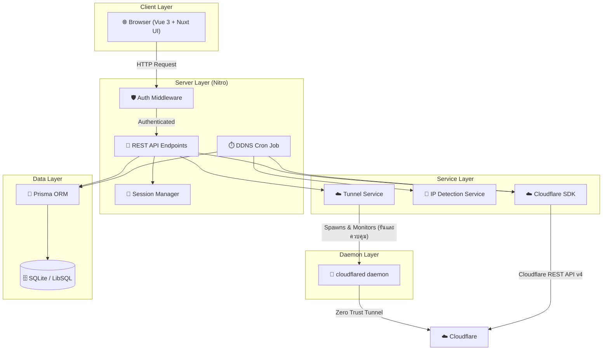

<div align="center">


# **TetherDNS**

### _ระบบจัดการ Cloudflare DNS และ Dynamic IP อย่างแม่นยำ_

<p align="center">
  <a href="https://nuxt.com/">
    
  </a>
  <a href="https://vuejs.org/">
    
  </a>
  <a href="https://tailwindcss.com/">
    
  </a>
  <a href="https://prisma.io/">
    
  </a>
  <a href="https://www.docker.com/">
    
  </a>
  <a href="https://developers.cloudflare.com/">
    
  </a>
</p>

**TetherDNS** คือเว็บแอปพลิเคชันแบบ Self-hosted ระดับองค์กร สำหรับจัดการ DNS Records ของ Cloudflare, อัปเดต Dynamic DNS (DDNS) อัตโนมัติ และควบคุมการรันระบบ Cloudflare Tunnels (Zero Trust) ในตัว เปลี่ยนการตั้งค่าเครือข่ายและการควบคุมเส้นทางโดเมนที่ซับซ้อนให้กลายเป็นเรื่องง่าย ภายใต้ UI ระดับพรีเมียมในธีม **Ocean Deep Tech**

[English](README.md) • [ภาษาไทย](README-TH.md)

</div>

---

## 📋 สารบัญ

- [✨ ฟีเจอร์](#-ฟีเจอร์)
- [🏗️ สถาปัตยกรรม](#️-สถาปัตยกรรม)
- [⚡ เริ่มต้นอย่างรวดเร็ว](#-เริ่มต้นอย่างรวดเร็ว)
  - [🐳 Docker (แนะนำ)](#-docker-แนะนำ)
  - [💻 การพัฒนาในเครื่อง](#-การพัฒนาในเครื่อง)
- [⚙️ การตั้งค่า](#️-การตั้งค่า)
- [🚀 การตั้งค่าครั้งแรก](#-การตั้งค่าครั้งแรก)
- [📖 คู่มือการใช้งาน](#-คู่มือการใช้งาน)
  - [🔐 บัญชี (Accounts)](#-บัญชี-accounts)
  - [🌍 DNS Zones](#-dns-zones)
  - [📝 DNS Records](#-dns-records)
  - [🔄 Dynamic DNS (DDNS)](#-dynamic-dns-ddns)
  - [📊 Logs และ Audit Trail](#-logs-และ-audit-trail)
  - [⚙️ การตั้งค่าและ 2FA](#️-การตั้งค่าและ-2fa)
- [🔗 Webhook API](#-webhook-api)
- [🛠️ คำสั่ง Scripts](#️-คำสั่ง-scripts)
- [🔒 ความปลอดภัย](#-ความปลอดภัย)
- [📜 สัญญาอนุญาต](#-สัญญาอนุญาต)

---

## ✨ ฟีเจอร์

### 🔐 ความปลอดภัยและการยืนยันตัวตน
| ฟีเจอร์ | คำอธิบาย |
|---|---|
| **Setup Wizard** | ขั้นตอนการตั้งค่าครั้งแรกเพื่อสร้างบัญชีผู้ดูแลระบบเมื่อเปิดใช้งานครั้งแรก |
| **TOTP 2FA** | การยืนยันตัวตนสองขั้นตอนมาตรฐานอุตสาหกรรม (ผ่าน `otplib`) พร้อม QR Code สำหรับสแกน |
| **bcrypt Password Hashing** | รหัสผ่านทั้งหมดจัดเก็บด้วย `bcryptjs` — ไม่มีการเก็บแบบ Plaintext |
| **Encrypted Sessions** | Session ฝั่งเซิร์ฟเวอร์แบบ HTTP-only เข้ารหัสด้วย Secret Key ยาว 32+ ตัวอักษร |
| **Cookie Security ที่ปรับได้** | ตั้งค่า `SESSION_SECURE` เพื่อบังคับใช้ HTTPS-only cookies ใน Production |
| **Auth Middleware** | ทุก Route ที่ได้รับการปกป้องถูกตรวจสอบฝั่งเซิร์ฟเวอร์ผ่าน Nitro Middleware |

### 🌍 Multi-Account และ Cloudflare DNS
| ฟีเจอร์ | คำอธิบาย |
|---|---|
| **Multi-Account Vault** | เพิ่มและจัดการบัญชี Cloudflare API หลายบัญชีจาก Dashboard เดียว |
| **Zone Explorer** | เรียกดู DNS Zones ทั้งหมดในทุกบัญชีพร้อมการค้นหาทันทีและ Pagination |
| **Full Record CRUD** | สร้าง, ดู, แก้ไข และลบ DNS Records: `A`, `AAAA`, `CNAME`, `TXT`, `MX`, `SRV` |
| **Proxy Toggle** | เปิด/ปิด Cloudflare Proxy (เมฆสีส้ม ☁️) ต่อ Record ด้วยคลิกเดียว |
| **TTL Control** | ปรับ Time-To-Live ต่อ Record รองรับ `1` (Auto) และค่า TTL มาตรฐานทั้งหมด |

### 🔄 ระบบ Dynamic DNS (DDNS) อัตโนมัติ
| ฟีเจอร์ | คำอธิบาย |
|---|---|
| **Auto IP Detection** | Cron Job ในตัวตรวจสอบและอัปเดต IP สาธารณะในช่วงเวลาที่กำหนด (ค่าเริ่มต้น: ทุก 5 นาที) |
| **DDNS ต่อ Record** | เปิดใช้ DDNS บน `A` หรือ `AAAA` Record ใดก็ได้เป็นรายตัว |
| **Webhook Endpoints** | สร้าง Webhook URL เฉพาะ เพื่อเรียก DDNS update จากเราเตอร์, Script หรือเครื่องมือ Automation |
| **รองรับ IPv4 และ IPv6** | ตรวจจับและอัปเดตทั้ง IPv4 (`A`) และ IPv6 (`AAAA`) แยกอิสระจากกัน |

### ☁️ ระบบ Cloudflare Tunnel ในตัว (Zero Trust)

| ฟีเจอร์ | คำอธิบาย |
|---|---|
| **Zero-Image Embedded Daemon** | ดาวน์โหลดและรันโปรเซส `cloudflared` ท้องถิ่นในตัวผ่าน Container โดยตรง ไม่ต้องดึง Docker image แยกหรือตั้งค่า sidecar เพิ่มเติม |
| **จัดการ Tunnel ผ่าน Dashboard** | สร้าง, ลบ, ดูบันทึกการทำงาน (Log) และควบคุมการทำงานของ Cloud-managed Zero Trust Tunnel ได้ครบวงจรผ่านหน้าจอเว็บ |
| **สลับโหมดการชี้ DNS ได้อิสระ** | เลือกสลับโหมดของ DNS Record แต่ละรายการได้ทันทีระหว่าง: **Static (แบบป้อนเอง)**, **Dynamic IP (DDNS)** หรือ **Cloudflare Tunnel (Zero Trust)** |
| **ควบคุมการเปิด/ปิดและต่ออายุอัตโนมัติ** | ตรวจจับและเริ่มการทำงานของอุโมงค์พื้นหลัง (Background daemon) ของ Tunnel ที่เปิดใช้งานอยู่อัตโนมัติทันทีที่เซิร์ฟเวอร์สตาร์ต พร้อมระบบดักต่อสายอัตโนมัติ |
| **สตรีมดูบันทึกการเชื่อมต่อสด (Live Logs)** | แสดงผลข้อมูลการเชื่อมต่อและข้อผิดพลาดส่งตรงจากโปรเซส `cloudflared` ขึ้นมาให้ตรวจสอบบนหน้าเว็บแบบสด ๆ |
| **Two-way Integrity Sync** | ระบบตรวจสอบและประสานสถานะความถูกต้องกับ Cloudflare Dashboard แบบสองทาง ลบรายการตกค้างในฐานข้อมูลหากมีการลบ DNS จากนอกแอป |


### 📊 Analytics และ Logging
| ฟีเจอร์ | คำอธิบาย |
|---|---|
| **IP History Charts** | กราฟ ApexCharts แบบ Interactive ติดตามประวัติการเปลี่ยนแปลง IP ตลอดช่วงเวลา |
| **Real-Time Audit Log** | บันทึกที่ไม่สามารถแก้ไขได้ พร้อม Timestamp ของทุกการ Login, Logout, การเปลี่ยนค่าคอนฟิก และ DDNS update |
| **DDNS Event Log** | มุมมองเฉพาะสำหรับเหตุการณ์ DDNS แสดง IP ก่อน/หลังการอัปเดตทุกครั้ง |

### 🎨 UI / UX
| ฟีเจอร์ | คำอธิบาย |
|---|---|
| **Ocean Deep Tech Theme** | UI มืดแบบ Glassmorphism โทน Deep Indigo ออกแบบเพื่อลดการล้าของดวงตา |
| **Responsive Design** | รองรับทุกขนาดหน้าจอ ตั้งแต่ Desktop 4K ถึง Mobile |
| **รองรับ i18n** | รองรับสองภาษาเต็มรูปแบบ: ภาษาอังกฤษ 🇬🇧 และภาษาไทย 🇹🇭 (ผ่าน `@nuxtjs/i18n`) |

---

## 🏗️ สถาปัตยกรรม



### เทคโนโลยีที่ใช้

| Layer | เทคโนโลยี |
|---|---|
| **Frontend Framework** | [Nuxt 4](https://nuxt.com/) + [Vue 3](https://vuejs.org/) (Composition API) |
| **UI Component Library** | [@nuxt/ui](https://ui.nuxt.com/) v4 + [Tailwind CSS](https://tailwindcss.com/) |
| **Server Engine** | [Nitro](https://nitro.build/) (ติดตั้งมากับ Nuxt) |
| **Database ORM** | [Prisma](https://prisma.io/) v7 พร้อม `@prisma/adapter-libsql` |
| **Database** | SQLite (ผ่าน LibSQL) — ไม่มี Dependencies, ใช้ไฟล์ |
| **Cloudflare Client** | Official [`cloudflare`](https://github.com/cloudflare/cloudflare-typescript) TypeScript SDK v5 |
| **Authentication** | `nuxt-auth-utils` session + `bcryptjs` + `otplib` (TOTP 2FA) |
| **Charts** | [ApexCharts](https://apexcharts.com/) + `vue3-apexcharts` |
| **i18n** | `@nuxtjs/i18n` v10 |
| **Icons** | `heroicons` + `lucide` ผ่าน `@nuxt/icon` |
| **Tunnel Daemon** | โปรแกรม [cloudflared](https://github.com/cloudflare/cloudflared) Zero Trust สำหรับรันอุโมงค์เชื่อมต่อ |

---

## ⚡ เริ่มต้นอย่างรวดเร็ว

### 🐳 Docker (แนะนำ)

วิธีที่เร็วที่สุดในการรัน TetherDNS ใน Production ต้องการ [Docker](https://docs.docker.com/get-docker/) และ [Docker Compose](https://docs.docker.com/compose/)

**ขั้นตอนที่ 1 — Clone Repository**
```bash
git clone https://github.com/riiixch/TetherDNS.git
cd TetherDNS
```

**ขั้นตอนที่ 2 — ตั้งค่า Environment**
```bash
# คัดลอกไฟล์ตัวอย่าง
cp .env.example .env

# แก้ไขไฟล์และตั้งค่า SESSION_PASSWORD ของคุณ (ต้องยาว 32+ ตัวอักษร!)
# ดูรายละเอียดเพิ่มเติมในส่วน Configuration ด้านล่าง
```

> **⚠️ สำคัญมาก:** ตัวแปร `SESSION_PASSWORD` **ต้องยาวอย่างน้อย 32 ตัวอักษร** หากใส่ Password ที่สั้นเกินไปจะเกิด Error `500` ทุกครั้งที่มี Request เข้ามา

**ขั้นตอนที่ 3 — Build และสตาร์ท Container**
```bash
docker compose up -d --build
```

**ขั้นตอนที่ 4 — เข้าใช้งานแอป**

เปิดเบราว์เซอร์และไปที่: **`http://localhost:3000`**

ระบบจะพาไปยัง **Setup Wizard** โดยอัตโนมัติเมื่อเปิดครั้งแรก

---

**อัปเดตเป็นเวอร์ชันใหม่:**
```bash
git pull
docker compose down
docker compose up -d --build
```

**ดู Log แบบ Live:**
```bash
docker compose logs -f tetherdns
```

**หยุดการทำงาน:**
```bash
docker compose down
```

---

### 💻 การพัฒนาในเครื่อง

สำหรับผู้ร่วมพัฒนาและ Developer ที่ต้องการต่อยอดหรือปรับแต่ง TetherDNS

**สิ่งที่ต้องมีก่อน:**
- [Node.js](https://nodejs.org/) v20 ขึ้นไป
- npm v10 ขึ้นไป

**ขั้นตอนที่ 1 — Clone และติดตั้ง Dependencies**
```bash
git clone https://github.com/riiixch/TetherDNS.git
cd TetherDNS
npm install
```

**ขั้นตอนที่ 2 — ตั้งค่า Environment Variables**
```bash
cp .env.example .env
# แก้ไข .env ตามที่ต้องการ
```

**ขั้นตอนที่ 3 — สร้างฐานข้อมูล**
```bash
npx prisma db push
```

**ขั้นตอนที่ 4 — สตาร์ท Development Server**
```bash
npm run dev
```

Dev Server พร้อมใช้งานที่: **`http://localhost:3000`** พร้อม Hot Module Replacement (HMR)

> **💡 หมายเหตุสำหรับการทดสอบ Cloudflare Tunnel ในเครื่อง:**
> ฟีเจอร์ Tunnel จำเป็นต้องใช้โปรแกรม `cloudflared` ในเครื่อง ในขณะที่การรันบน Docker จะติดตั้งโปรแกรมนี้ให้อัตโนมัติ แต่สำหรับการพัฒนาและทดสอบในคอมพิวเตอร์ของคุณ (Windows/macOS/Linux) คุณจำเป็นต้องดาวน์โหลด `cloudflared` ของระบบปฏิบัติการนั้น ๆ และนำไปตั้งค่าไว้ใน System PATH ของเครื่องก่อน จึงจะสามารถกดรันอุโมงค์เบื้องหลัง (Daemon Run) เพื่อทดสอบแบบ Local ได้

---

## ⚙️ การตั้งค่า

การตั้งค่าทั้งหมดทำผ่าน Environment Variables สำหรับ Docker ให้ตั้งค่าใน `docker-compose.yml` สำหรับการพัฒนาในเครื่องให้ใช้ไฟล์ `.env`

| ตัวแปร | จำเป็น | ค่าเริ่มต้น | คำอธิบาย |
|---|---|---|---|
| `DATABASE_URL` | ✅ ใช่ | `file:./tetherdns.db` | Path ไปยังไฟล์ฐานข้อมูล SQLite สำหรับ Docker ให้ใช้ Path แบบ Absolute เช่น `file:/app/data/tetherdns.db` เพื่อให้ข้อมูลคงอยู่ผ่าน Volume |
| `SESSION_PASSWORD` | ✅ ใช่ | _(ไม่มี)_ | **ต้องยาว 32+ ตัวอักษร** Secret แบบสุ่มและแข็งแกร่งสำหรับเข้ารหัส Session Cookie สร้างด้วย `openssl rand -base64 48` |
| `SESSION_SECURE` | ✅ ใช่ | `false` | ตั้งเป็น `true` เพื่อบังคับใช้ HTTPS-only Cookies **ควรเป็น `true` เสมอใน Production ที่ใช้ HTTPS** ตั้งเป็น `false` สำหรับ HTTP หรือการพัฒนาในเครื่อง |
| `NODE_ENV` | ✅ ใช่ | `development` | ตั้งเป็น `production` สำหรับ Instance ที่ Deploy แล้ว |
| `TZ` | ไม่บังคับ | ตามระบบ | Timezone สำหรับ Timestamp ของ Log เช่น `Asia/Bangkok`, `America/New_York` |
| `PORT` | ไม่บังคับ | `3000` | Port ที่เซิร์ฟเวอร์รับฟัง |
| `HOST` | ไม่บังคับ | `0.0.0.0` | Host Address ที่ผูกกับเซิร์ฟเวอร์ |

### การสร้าง `SESSION_PASSWORD` ที่ปลอดภัย

```bash
# ใช้ openssl (Linux/macOS/WSL)
openssl rand -base64 48

# ใช้ Node.js
node -e "console.log(require('crypto').randomBytes(48).toString('base64'))"

# ใช้ PowerShell (Windows)
[System.Convert]::ToBase64String((1..48 | ForEach-Object { [byte](Get-Random -Max 256) }))
```

### ตัวอย่าง `docker-compose.yml`

```yaml
services:
  tetherdns:
    image: tetherdns:latest
    container_name: tetherdns
    restart: always
    volumes:
      - ./data:/app/data          # เก็บฐานข้อมูลไว้นอก Container
    environment:
      - DATABASE_URL=file:/app/data/tetherdns.db
      - SESSION_PASSWORD=your-super-secret-key-min-32-characters-long
      - SESSION_SECURE=false      # ตั้งเป็น true หากใช้ HTTPS
      - NODE_ENV=production
      - TZ=Asia/Bangkok
    ports:
      - "3000:3000"
```

> **💡 เคล็ดลับ:** การ Mount `./data` เป็น Volume ทำให้ไฟล์ฐานข้อมูลรอดได้เมื่อ Container รีสตาร์ทหรืออัปเกรด

---

## 🚀 การตั้งค่าครั้งแรก

เมื่อเปิด TetherDNS ครั้งแรกโดยที่ฐานข้อมูลยังว่างเปล่า ระบบจะ Redirect ไปยัง **Setup Wizard** ที่ `/setup` โดยอัตโนมัติ

**1. สร้างบัญชีผู้ดูแลระบบ**
- ใส่ชื่อผู้ใช้และรหัสผ่านที่แข็งแกร่งสำหรับบัญชี Admin
- นี่คือบัญชีหลักสำหรับเข้าถึง TetherDNS Dashboard

**2. (ไม่บังคับ) เปิดใช้งาน Two-Factor Authentication**
- หลัง Setup เสร็จ ไปที่ **Settings** (⚙️) → **Security**
- คลิก **Enable 2FA** เพื่อสร้าง QR Code
- สแกน QR Code ด้วย Authenticator App (เช่น Google Authenticator, Authy)
- ใส่รหัส TOTP 6 หลักเพื่อยืนยันและเปิดใช้ 2FA

เมื่อ Setup เสร็จสมบูรณ์ ระบบจะ Redirect ไปยังหน้า **Login**

---

## 📖 คู่มือการใช้งาน

### 🔐 บัญชี (Accounts)

หน้า **Accounts** คือที่จัดการ Cloudflare API Credentials ของคุณ

**การเพิ่มบัญชี Cloudflare:**
1. ไปที่แท็บ **Accounts**
2. คลิก **+ Add Account**
3. ใส่ **ชื่อ** ที่จำง่ายสำหรับบัญชีนี้ (เช่น "Cloudflare ส่วนตัว")
4. ใส่ Cloudflare **API Token**
   - ไปที่ [Cloudflare Dashboard → My Profile → API Tokens](https://dash.cloudflare.com/profile/api-tokens)
   - สร้าง Token แบบปรับแต่งเอง (Custom Token) โดยให้มีสิทธิ์เข้าถึงดังนี้:
     - **Zone** → **DNS** → **Edit**
     - **Zone** → **Zone** → **Read**
     - **Account** → **Cloudflare Tunnel** → **Edit** *(จำเป็นสำหรับการจัดการ Tunnel)*
     - **Account** → **Account Settings** → **Read**
5. คลิก **Save** ระบบจะตรวจสอบ Token กับ Cloudflare API ทันที

**การจัดการบัญชี:**
- **แก้ไข:** อัปเดตชื่อบัญชีหรือ API Token ได้ทุกเวลา
- **ลบ:** ลบบัญชีออก ซึ่งจะลบ Zone และ DDNS Configuration ที่เกี่ยวข้องทั้งหมดออกจาก TetherDNS ด้วย (แต่จะ **ไม่** ลบข้อมูลใดๆ ออกจาก Cloudflare)

---

### 🌍 DNS Zones

หน้า **Zones** แสดงรายการ DNS Zones (โดเมน) ทั้งหมดที่พบในบัญชี Cloudflare ที่ตั้งค่าไว้

- **ค้นหา:** ใช้ช่องค้นหาเพื่อกรอง Zone ตามชื่อโดเมน
- **Pagination:** เลื่อนดูรายการขนาดใหญ่
- **เลือก Zone:** คลิกที่ Zone ใดก็ได้เพื่อเปิดหน้าจัดการ DNS Records

---

### 📝 DNS Records

ภายใน Zone คุณสามารถดูและจัดการ DNS Records ทั้งหมดได้

**ประเภท Record ที่รองรับ:** `A`, `AAAA`, `CNAME`, `TXT`, `MX`, `SRV`

**การเพิ่ม Record:**
1. คลิกปุ่ม **+ Add Record**
2. เลือก **Routing Mode** (Static, DDNS หรือ Cloudflare Tunnel)
3. ใส่ **Name** (เช่น `@` สำหรับ Root, `www`, `mail`)
4. ในกรณีที่เลือก **Static / DDNS Mode**: ให้กรอกข้อมูล **Content** (เช่น IP Address หรือโดเมนปลายทาง) และตั้งค่า **Proxied** (☁️)
5. ในกรณีที่เลือก **Tunnel Mode**: ให้เลือก **Cloudflare Tunnel** ที่ทำงานอยู่ และระบุที่อยู่ของเครื่องปลายทางในเครือข่ายท้องถิ่นของคุณในส่วน **Local Target Address** (เช่น `http://localhost:8080`)
6. คลิก **Save**

**การแก้ไข Record:**
1. คลิกไอคอน **✏️ Edit** ในแถว Record ที่ต้องการ
2. ปรับแก้ไขค่าต่าง ๆ (รวมทั้งสามารถเลือกสลับ Routing Mode ได้ทันที) และคลิก **Save**

**การลบ Record:**
1. คลิกไอคอน **🗑️ Delete** ในแถว Record
2. ยืนยันการลบในกล่องโต้ตอบ

> **⚠️ คำเตือน:** การลบจะถูกส่งไปยัง Cloudflare API ทันทีและไม่สามารถยกเลิกได้ผ่าน TetherDNS

---

### ☁️ ระบบ Cloudflare Tunnel (Zero Trust)

TetherDNS มาพร้อมกับระบบรัน Daemon ของ `cloudflared` ภายในตัว เพื่อให้คุณสร้างอุโมงค์เชื่อมต่อแบบ Zero Trust ได้อย่างปลอดภัยและง่ายดายจากหน้า Dashboard เพื่อเปิดให้เข้าถึงแอปภายในบ้านหรือออฟฟิศของคุณโดยไม่ต้องทำ Port Forwarding หรือเปิดช่องทางรับส่งข้อมูลจากภายนอกเราเตอร์

**การสร้าง Tunnel:**
1. ไปที่แท็บ **Tunnels**
2. คลิกปุ่ม **Create Tunnel**
3. ตั้งชื่อ Tunnel ที่จดจำได้ง่าย (เช่น `homeserver-tunnel`)
4. คลิก **Create** ระบบจะส่งคำขอเพื่อขึ้นทะเบียน Cloud-managed Tunnel บน Cloudflare ให้อัตโนมัติ

**การเปิดรัน Tunnel:**
- ค้นหา Tunnel ที่เพิ่งสร้างขึ้นในตารางรายการ และกดเปิดการทำงานสวิตช์ **Daemon Run** ให้มีสถานะเป็น **Active**
- ตัวรัน Daemon ในระบบจะเรียกทำงานโปรเซส `cloudflared` ขึ้นมาทำงานเบื้องหลัง คุณสามารถคลิกดูบันทึกของตัวโปรเซสสด ๆ ได้ตลอดเวลาโดยกดปุ่ม **Logs**

**การผูกเส้นทางเครือข่าย (Routing):**
- เข้าไปที่ **DNS Zones** ใด ๆ ของคุณ ทำการเพิ่ม/แก้ไข DNS Record
- สลับโหมด Routing Mode เป็น **Cloudflare Tunnel** จากนั้นเลือกชื่อ Tunnel ที่กำลังใช้งานและกรอกเส้นทางเครื่องภายในบ้าน (เช่น `http://localhost:3000`)
- TetherDNS จะเปลี่ยน DNS Record ดังกล่าวให้ชี้ CNAME ไปยัง `<tunnel-id>.cfargotunnel.com` บน Cloudflare และบันทึกกฎเส้นทางการเข้าถึง (Ingress configuration rule) ไปยัง Tunnel daemon ทันที

---

### 🔄 Dynamic DNS (DDNS)

DDNS อัปเดต DNS Records ของคุณให้ตรงกับ Public IP ปัจจุบันโดยอัตโนมัติ จำเป็นมากสำหรับ Home Server หรืออุปกรณ์ใดๆ ที่มี Dynamic IP

**หลักการทำงาน:**
1. Cron Job รันในพื้นหลังทุก **5 นาที** (ปรับได้)
2. ตรวจจับ Public IPv4 และ IPv6 ปัจจุบันของคุณ
3. `A` หรือ `AAAA` Record ใดก็ตามที่เปิด DDNS ไว้จะถูกอัปเดตใน Cloudflare โดยอัตโนมัติเมื่อ IP เปลี่ยน

**การเปิด DDNS บน Record:**
1. เปิด Zone และค้นหา `A` หรือ `AAAA` Record
2. Toggle สวิตช์ **DDNS** บน Record นั้น
3. TetherDNS จะติดตามและอัปเดต Record นั้นโดยอัตโนมัติ

**DDNS ผ่าน Webhook:**
สำหรับการอัปเดตทันทีโดยไม่ต้องรอรอบ Cron ให้ใช้ Webhook URL ที่สร้างขึ้น ดูส่วน [Webhook API](#-webhook-api) ด้านล่าง

---

### 📊 Logs และ Audit Trail

**Audit Log (`/audit`)**
บันทึกครบถ้วนแบบ Real-time ของทุกการกระทำของผู้ใช้และระบบ:
- การ Login และ Logout ของ Admin
- การเพิ่ม, แก้ไข และลบบัญชี
- การเปลี่ยนแปลง DNS Record (สร้าง, อัปเดต, ลบ)
- เหตุการณ์ DDNS Cron Job และการแจ้งเตือนเมื่อ IP เปลี่ยน

**DDNS Log (`/logs`)**
มุมมองเฉพาะสำหรับเหตุการณ์ DDNS แสดง Timestamp, Record ที่เกิดผล, IP เดิม และ IP ใหม่ทุกการอัปเดตอัตโนมัติ

---

### ⚙️ การตั้งค่าและ 2FA

**การเข้าถึง Settings:** คลิกไอคอน ⚙️ ในแถบนำทาง

**Profile Settings:**
- เปลี่ยน **ชื่อผู้ใช้** และ **รหัสผ่าน** Admin

**Two-Factor Authentication (2FA):**
| สถานะ | การกระทำ |
|---|---|
| **ปิดอยู่** | คลิก **Enable 2FA** → สแกน QR Code ด้วย Authenticator App → ใส่รหัส 6 หลักเพื่อยืนยัน |
| **เปิดอยู่** | คลิก **Disable 2FA** → ใส่รหัส 2FA ปัจจุบันเพื่อยืนยันการปิด |

> **🔑 สำรองข้อมูล:** เมื่อเปิด 2FA แล้ว ให้บันทึก Setup Key ไว้ในที่ปลอดภัย หากสูญเสียการเข้าถึง Authenticator App จะต้องเข้าถึงฐานข้อมูลโดยตรงเพื่อกู้คืน

**ภาษา:**
- ใช้ตัวสลับภาษา 🌐 ในแถบนำทางเพื่อสลับระหว่าง **ภาษาอังกฤษ** และ **ภาษาไทย**

---

## 🔗 Webhook API

TetherDNS เปิด Endpoint แบบ Webhook ที่เรียก DDNS update ทันทีสำหรับทุก Record ที่เปิดใช้งาน เหมาะสำหรับเราเตอร์ที่รองรับ DDNS Scripts แบบกำหนดเอง

**Endpoint:**
```
GET /api/webhook/ddns?token=<YOUR_WEBHOOK_TOKEN>
```

**วิธีรับ Token:**
1. ไปที่ **Settings** → **Webhook**
2. คัดลอก Token ที่สร้างขึ้น (หรือสร้างใหม่หากต้องการ)

**ตัวอย่างการใช้งาน:**

```bash
# เรียก Update โดยใช้ curl
curl "http://your-server:3000/api/webhook/ddns?token=YOUR_TOKEN_HERE"
```

```bash
# ใช้ใน Cron Job บนเซิร์ฟเวอร์อื่น
*/10 * * * * /usr/bin/curl -s "http://your-server:3000/api/webhook/ddns?token=YOUR_TOKEN_HERE"
```

**การตั้งค่าเราเตอร์ (DD-WRT / OpnSense / pfSense):**
- ตั้งค่า URL ของ DDNS Provider แบบกำหนดเองเป็น:
  ```
  http://your-server:3000/api/webhook/ddns?token=YOUR_TOKEN_HERE
  ```

**Response:**
```json
{ "success": true, "updated": 2 }
```

---

## 🛠️ คำสั่ง Scripts

รันทุก Script ด้วย `npm run <script>`

| Script | คำสั่ง | คำอธิบาย |
|---|---|---|
| `dev` | `nuxt dev` | สตาร์ท Development Server พร้อม HMR |
| `build` | `nuxt build` | Build แอปสำหรับ Production |
| `preview` | `nuxt preview` | Preview Production Build ในเครื่อง |
| `generate` | `nuxt generate` | สร้างเวอร์ชัน Static ของแอป |
| `prisma:gen` | `npx prisma generate` | สร้าง Prisma Client ใหม่หลังเปลี่ยน Schema |
| `prisma:push` | `npx prisma db push` | Push Prisma Schema ไปยังฐานข้อมูล (สร้างตารางอัตโนมัติ) |
| `prisma:reset` | `npx prisma migrate reset` | ⚠️ **อันตราย!** Reset ฐานข้อมูลให้เป็นสถานะว่างเปล่า |
| `update:check` | `npx npm-check-updates` | ตรวจสอบการอัปเดต Dependencies ที่มี |
| `update:install` | `npx npm-check-updates -u && npm install` | ติดตั้ง Dependencies ที่อัปเดตทั้งหมด |

---

## 🔒 ความปลอดภัย

TetherDNS ออกแบบโดยมีความปลอดภัยเป็นสิ่งสำคัญอันดับแรก:

- **ไม่เก็บ Credentials แบบ Plaintext** รหัสผ่านทั้งหมด Hash ด้วย `bcryptjs`
- **การเข้ารหัส Session** Session ถูกเข้ารหัสด้วย Secret Key ที่ผู้ใช้กำหนด (ขั้นต่ำ 32 ตัวอักษร) โดยใช้ `iron-webcrypto` Key ที่อ่อนแอหรือขาดหายจะทำให้เกิด Error ทันที
- **HTTP-only Cookies** Session Cookie ไม่สามารถเข้าถึงได้จาก JavaScript ฝั่ง Client ป้องกันการโจมตีแบบ XSS
- **Auth Middleware ฝั่งเซิร์ฟเวอร์** ทุก API Route และหน้าที่ได้รับการปกป้องถูกตรวจสอบฝั่งเซิร์ฟเวอร์ก่อนส่งข้อมูลใดๆ
- **แยก API Token** Cloudflare API Token จัดเก็บในฐานข้อมูลในเครื่องและไม่เคยถูกส่งไปยัง Frontend
- **TOTP 2FA** ปัจจัยที่สองที่แนะนำให้เปิดใช้งาน ป้องกันการขโมย Credentials

**คำแนะนำด้านความปลอดภัยสำหรับ Production:**
1. ใช้ `SESSION_SECURE=true` เสมอเบื้องหลัง HTTPS Reverse Proxy (เช่น Nginx, Caddy, Traefik)
2. ใช้ `SESSION_PASSWORD` แบบสุ่มที่มีความยาวอย่างน้อย 48 ตัวอักษร
3. เปิด TOTP 2FA ทันทีหลัง Setup เสร็จ
4. จำกัดการเข้าถึง Port `3000` ผ่าน Firewall หรือ Reverse Proxy — อย่า Expose ตรงสู่อินเทอร์เน็ตโดยตรง
5. ใช้ Cloudflare API Token ที่มีสิทธิ์**ขั้นต่ำที่จำเป็น** ไม่ใช่ Global API Key

---

## 📜 สัญญาอนุญาต

เผยแพร่ภายใต้ **MIT License** ดูรายละเอียดทั้งหมดได้ที่ [LICENSE](./LICENSE)

---

<div align="center">

### 🌊 Master Your Network. Master the Deep.

**สร้างสรรค์ด้วยความหลงใหลอย่างไม่มีที่สิ้นสุด โดย [RIIIXCH](https://github.com/riiixch)**

</div>
