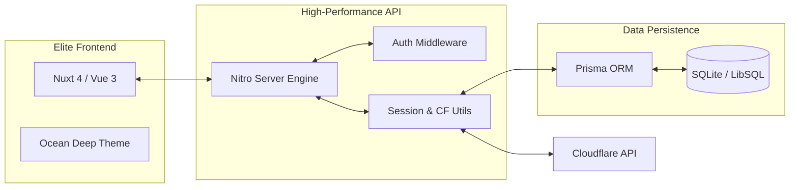

<div align="center">


# **TetherDNS**

### _Precision Cloudflare DNS & Dynamic IP Orchestrator_

<p align="center">
  <a href="https://nuxt.com/">
    
  </a>
  <a href="https://vuejs.org/">
    
  </a>
  <a href="https://tailwindcss.com/">
    
  </a>
  <a href="https://prisma.io/">
    
  </a>
  <a href="https://www.docker.com/">
    
  </a>
</p>

**TetherDNS** คือเว็บแอปพลิเคชันประสิทธิภาพสูงระดับองค์กร (Enterprise-ready) ที่ออกแบบมาเพื่อการจัดการ DNS ขั้นสูง เป็นตัวกลางที่เชื่อมเปลี่ยนการตั้งค่าเครือข่ายที่ซับซ้อนให้กลายเป็นการควบคุมที่ง่ายดาย ภายใต้ประสบการณ์การใช้งานระดับพรีเมียมในธีม **Ocean Deep Tech**

[English](README.md) • [ภาษาไทย](README-TH.md)

</div>

---

## 💎 นิยามใหม่ของการจัดการ DNS

มากกว่าแค่เครื่องมือทั่วไป TetherDNS คือระบบจัดการแบบครบวงจร (Orchestration suite) ที่ออกแบบมาเพื่อเคารพเวลาและเวิร์กโฟลว์ของคุณ

### 🌌 ประสบการณ์แบบ "Ocean Deep"

สัมผัสกับ UI ที่ถูกคราฟต์มาเป็นพิเศษสำหรับการนั่งจัดการระบบเป็นเวลานาน:

- **Glassmorphism:** เลเยอร์กึ่งโปร่งใสที่ดูหรูหรา ช่วยให้คุณโฟกัสกับงานโดยไม่มีสิ่งรบกวน
- **Deep Indigo Syntax:** ทฤษฎีสีที่ออกแบบมาเฉพาะเพื่อลดอาการล้าของดวงตา ระหว่างการทำงานกลางดึก
- **Responsive Fluidity:** จัดการโครงสร้างพื้นฐาน (Infrastructure) ทั้งหมดของคุณได้อย่างไร้รอยต่อ ตั้งแต่หน้าจอ Desktop 4K ไปจนถึงหน้าจอมือถือ

---

## 🚀 ฟีเจอร์ระดับจักรวาล (Feature Galaxy)

### 🔐 ความปลอดภัยแกนหลัก (Core Security)

- **Multi-Account Vault:** จัดเก็บและจัดการบัญชี Cloudflare หลายบัญชีอย่างปลอดภัยจากแดชบอร์ดเดียว
- **TOTP 2FA Protection:** ปกป้องหน้า Admin Console ด้วยการยืนยันตัวตนแบบสองขั้นตอน (2FA) ระดับองค์กร
- **Encrypted Sessions:** รักษาความปลอดภัยของ Cookie ระดับอุตสาหกรรม (HTTP-only) พร้อมนโยบายที่เข้มงวดและปรับแต่งได้

### 🌍 การจัดการโซนแบบเบ็ดเสร็จ (Zone Mastery)

- **Intelligent Explorer:** ค้นหา กรอง และแบ่งหน้า (Pagination) ได้ทันทีแม้มีโดเมนภายใต้การจัดการนับร้อย
- **Precision Record CRUD:** เพิ่ม, แก้ไข และลบเรคคอร์ด `A`, `AAAA`, `CNAME`, `TXT`, `MX`, และ `SRV` พร้อมการตรวจสอบความถูกต้อง (Validation) แบบเรียลไทม์
- **Proxy Orchestration:** เปิด/ปิด Cloudflare Proxy (เมฆสีส้ม) และปรับตั้งค่า TTL ได้อย่างราบรื่นและรวดเร็ว

### 🔄 ระบบอัตโนมัติและความอัจฉริยะ (Automation & Intelligence)

- **Webhook API Generation:** สร้าง URL Endpoint ที่มีความปลอดภัยเฉพาะตัว เพื่อรับการอัปเดต Dynamic IP (DDNS) อัตโนมัติจากเราเตอร์หรือสคริปต์ต่างๆ
- **IP Analytics Engine:** กราฟแสดงผลแบบ Interactive เพื่อติดตามการเปลี่ยนแปลง (Mutations) และความเสถียรของ IP ตลอดช่วงเวลาที่ผ่านมา
- **Real-Time Audit Trail:** บันทึก Log ที่ไม่สามารถแก้ไขได้ (Immutable) สำหรับทุกการล็อกอิน, การเปลี่ยนคอนฟิก, และการอัปเดตอัตโนมัติ เพื่อความโปร่งใสสูงสุดของระบบ

---

## 🏗️ สถาปัตยกรรมทางเทคนิค



---

## 📦 เริ่มต้นใช้งานอย่างรวดเร็ว

### 🐳 วิธีใช้งานผ่าน Docker (แนะนำ)

Deploy ขึ้น Production ได้ในไม่กี่วินาที โดยไม่ต้องตั้งค่าด้วยตัวเองให้วุ่นวาย:

```bash
# 1. โคลน Repository
git clone [https://github.com/riiixch/TetherDNS.git](https://github.com/riiixch/TetherDNS.git)
cd TetherDNS

# 2. คัดลอกและตั้งค่า Environment Variables
cp .env.example .env

# 3. สตาร์ทระบบ
docker-compose up -d --build

```

### 💻 สำหรับนักพัฒนา (Developer Track)

สำหรับนักพัฒนาที่ต้องการต่อยอด ปรับแต่ง หรือร่วมพัฒนา (Contribute):

```bash
# ติดตั้ง Dependencies ทั้งหมด
npm install

# สร้างและพุชโครงสร้างฐานข้อมูล (Schema) ลง SQLite
npx prisma db push

# รันเซิร์ฟเวอร์สำหรับโหมดนักพัฒนา
npm run dev

```

---

## ⚙️ แผงควบคุมระบบ (.env)

คุณสามารถปรับแต่ง Instance ของคุณผ่านตัวแปรในไฟล์ `.env`:

| ขอบเขต (Scope)  | ตัวแปร (Variable)  | ความสำคัญ (Significance)                                                           |
| --------------- | ------------------ | ---------------------------------------------------------------------------------- |
| **ฐานข้อมูล**   | `DATABASE_URL`     | Path แบบ Absolute ที่ชี้ไปยังฐานข้อมูล SQLite (เช่น `file:/app/data/tetherdns.db`) |
| **ความปลอดภัย** | `SESSION_PASSWORD` | รหัสผ่านเข้ารหัสความปลอดภัยสูง (ยาว 32+ ตัวอักษร) สำหรับจัดการ User Session        |
| **เครือข่าย**   | `SESSION_SECURE`   | ตั้งค่าเป็น `true` เพื่อบังคับใช้ HTTPS (Strict Transport Security) สำหรับ Cookies |
| **ระบบเวลา**    | `TZ`               | Timezone ของระบบเพื่อให้การบันทึก Log แม่นยำ (เช่น `Asia/Bangkok`)                 |

---

## 📜 ลิขสิทธิ์ (License)

ภูมิใจเผยแพร่ภายใต้ **MIT License** เราเชื่อมั่นในซอฟต์แวร์แบบเปิด (Open-source) ที่มีคุณภาพสูง ดูรายละเอียดเพิ่มเติมได้ที่ [LICENSE](https://www.google.com/search?q=LICENSE)

---

<div align="center">

### 🌊 Master Your Network. Master the Deep.

**สร้างสรรค์ด้วยความหลงใหลอย่างไม่มีที่สิ้นสุด โดย [RIIIXCH](https://github.com/riiixch)**

</div>
