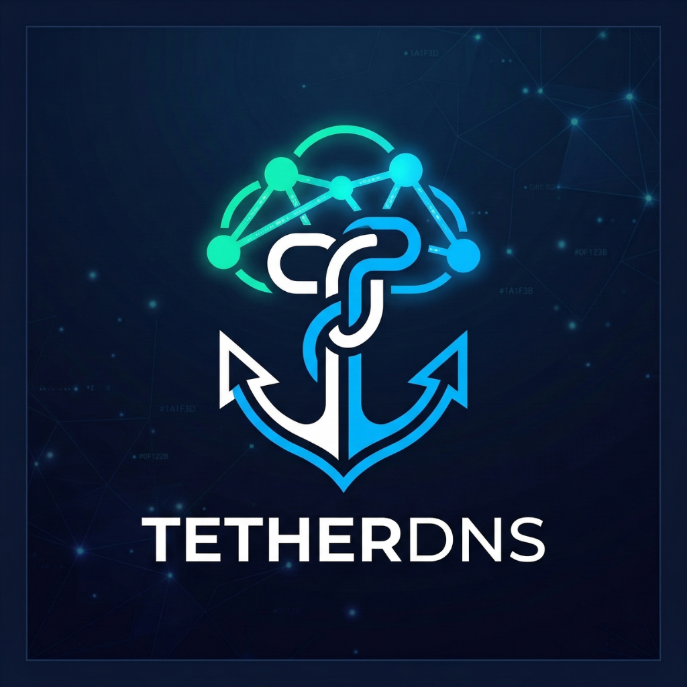
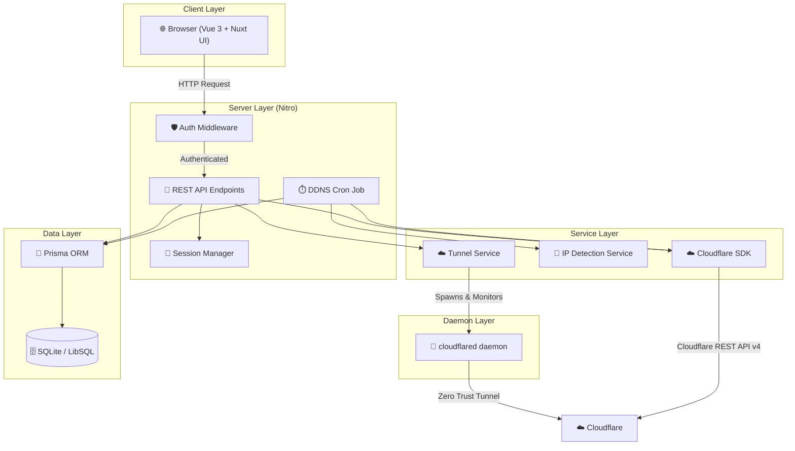

<div align="center">



# **TetherDNS**

### _Precision Cloudflare DNS & Dynamic IP Orchestrator_

<p align="center">
  <a href="https://nuxt.com/">
    
  </a>
  <a href="https://vuejs.org/">
    
  </a>
  <a href="https://tailwindcss.com/">
    
  </a>
  <a href="https://prisma.io/">
    
  </a>
  <a href="https://www.docker.com/">
    
  </a>
  <a href="https://developers.cloudflare.com/">
    
  </a>
</p>

**TetherDNS** is a self-hosted, enterprise-ready web application for managing Cloudflare DNS records, automating Dynamic DNS (DDNS) updates, and orchestrating embedded Cloudflare Tunnels (Zero Trust). It turns complex network routing and domain orchestration into effortless control, all wrapped in a premium **Ocean Deep Tech** UI.

[English](README.md) • [ภาษาไทย](README-TH.md)

</div>

---

## 📋 Table of Contents

- [✨ Features](#-features)
- [🏗️ Architecture](#️-architecture)
- [⚡ Quick Start](#-quick-start)
  - [🐳 Docker (Recommended)](#-docker-recommended)
  - [💻 Local Development](#-local-development)
- [⚙️ Configuration](#️-configuration)
- [🚀 First-Time Setup](#-first-time-setup)
- [📖 Usage Guide](#-usage-guide)
  - [🔐 Accounts](#-accounts)
  - [🌍 DNS Zones](#-dns-zones)
  - [📝 DNS Records](#-dns-records)
  - [🔄 Dynamic DNS (DDNS)](#-dynamic-dns-ddns)
  - [📊 Logs & Audit Trail](#-logs--audit-trail)
  - [⚙️ Settings & 2FA](#️-settings--2fa)
- [🔗 Webhook API](#-webhook-api)
- [🛠️ Scripts Reference](#️-scripts-reference)
- [🔒 Security](#-security)
- [📜 License](#-license)

---

## ✨ Features

### 🔐 Security & Authentication

| Feature                          | Description                                                                                                      |
| -------------------------------- | ---------------------------------------------------------------------------------------------------------------- |
| **Secure Setup Wizard**          | A one-time initialization flow to create your admin credentials on first launch                                  |
| **TOTP 2FA**                     | Industry-standard Time-based One-Time Password (via `otplib`) protects the admin console with QR-code scan setup |
| **bcrypt Password Hashing**      | All passwords are stored using battle-tested `bcryptjs` hashing — never in plaintext                             |
| **Encrypted Sessions**           | HTTP-only, server-side sessions encrypted with a 32+ character secret key                                        |
| **Configurable Cookie Security** | Toggle `SESSION_SECURE` to enforce HTTPS-only cookie transport in production                                     |
| **Auth Middleware**              | All protected routes are guarded server-side via Nitro middleware                                                |

### 🌍 Multi-Account & Cloudflare DNS

| Feature                 | Description                                                                            |
| ----------------------- | -------------------------------------------------------------------------------------- |
| **Multi-Account Vault** | Add and manage multiple Cloudflare API accounts from a single dashboard                |
| **Zone Explorer**       | Browse all DNS zones across accounts with instant search and pagination                |
| **Full Record CRUD**    | Create, read, update, and delete DNS records: `A`, `AAAA`, `CNAME`, `TXT`, `MX`, `SRV` |
| **Proxy Toggle**        | Enable or disable Cloudflare's proxy (Orange Cloud ☁️) per record with one click       |
| **TTL Control**         | Adjust Time-To-Live per record; supports `1` (Auto) and all standard TTL values        |

### 🔄 Dynamic DNS (DDNS) Automation

| Feature                 | Description                                                                                               |
| ----------------------- | --------------------------------------------------------------------------------------------------------- |
| **Auto IP Detection**   | Built-in cron job checks and updates your public IP at a configurable interval (default: every 5 minutes) |
| **Per-Record DDNS**     | Enable DDNS on any `A` or `AAAA` record individually                                                      |
| **Webhook Endpoints**   | Generate unique, signed webhook URLs to trigger DDNS updates from routers, scripts, or automation tools   |
| **IPv4 & IPv6 Support** | Detects and updates both IPv4 (`A`) and IPv6 (`AAAA`) records independently                               |

### ☁️ Embedded Cloudflare Tunnel (Zero Trust)

| Feature | Description |
| --- | --- |
| **Embedded Daemon Runner** | Auto-downloads and runs native `cloudflared` binary inside the Docker container, eliminating the need to pull separate sidecar containers. |
| **Cloud-Managed Tunnels** | Full creation, deletion, log inspection, and runtime control of Cloud-managed Zero Trust Tunnels directly from the UI dashboard. |
| **Flexible Routing Modes** | Instantly toggle any DNS record between: **Static (Manual)**, **Dynamic IP (DDNS)**, or **Cloudflare Tunnel (Zero Trust)** modes. |
| **Daemon Auto-Start & Control** | Automatically detects active tunnels, starts their corresponding background daemons on system startup, and handles automated reconnection. |
| **Real-time Logging Interface** | Stream and view live connection output from the `cloudflared` background daemon runner directly inside the web UI. |
| **Two-way Integrity Sync** | Automated reconciliation checks for changes or deletions directly on the Cloudflare Dashboard and purges dangling database records. |


### 📊 Analytics & Logging

| Feature                 | Description                                                                        |
| ----------------------- | ---------------------------------------------------------------------------------- |
| **IP History Charts**   | Interactive ApexCharts visualizations tracking your IP change history over time    |
| **Real-Time Audit Log** | Immutable, timestamped log of every login, logout, config change, and DDNS update  |
| **DDNS Event Log**      | Dedicated chronological view of all DDNS update events with IP before/after values |

### 🎨 UI / UX

| Feature                   | Description                                                                             |
| ------------------------- | --------------------------------------------------------------------------------------- |
| **Ocean Deep Tech Theme** | Glassmorphism-inspired dark UI with deep indigo tones, designed to minimize eye strain  |
| **Responsive Design**     | Fully responsive from 4K desktop down to mobile screens                                 |
| **i18n Support**          | Full internationalization with English 🇬🇧 and Thai 🇹🇭 language support (`@nuxtjs/i18n`) |

---

## 🏗️ Architecture



### Tech Stack

| Layer                    | Technology                                                                                     |
| ------------------------ | ---------------------------------------------------------------------------------------------- |
| **Frontend Framework**   | [Nuxt 4](https://nuxt.com/) + [Vue 3](https://vuejs.org/) (Composition API)                    |
| **UI Component Library** | [@nuxt/ui](https://ui.nuxt.com/) v4 + [Tailwind CSS](https://tailwindcss.com/)                 |
| **Server Engine**        | [Nitro](https://nitro.build/) (built into Nuxt)                                                |
| **Database ORM**         | [Prisma](https://prisma.io/) v7 with `@prisma/adapter-libsql`                                  |
| **Database**             | SQLite (via LibSQL) — zero-dependency, file-based                                              |
| **Cloudflare Client**    | Official [`cloudflare`](https://github.com/cloudflare/cloudflare-typescript) TypeScript SDK v5 |
| **Authentication**       | `nuxt-auth-utils` session + `bcryptjs` + `otplib` (TOTP 2FA)                                   |
| **Charts**               | [ApexCharts](https://apexcharts.com/) + `vue3-apexcharts`                                      |
| **i18n**                 | `@nuxtjs/i18n` v10                                                                             |
| **Icons**                | `heroicons` + `lucide` via `@nuxt/icon`                                                        |
| **Tunnel Daemon**         | [cloudflared](https://github.com/cloudflare/cloudflared) Zero Trust binary                     |

---

## ⚡ Quick Start

### 🐳 Docker (Recommended)

The fastest way to get TetherDNS running in production. Requires [Docker](https://docs.docker.com/get-docker/) and [Docker Compose](https://docs.docker.com/compose/).

**Step 1 — Clone the repository**

```bash
git clone https://github.com/riiixch/TetherDNS.git
cd TetherDNS
```

**Step 2 — Configure your environment**

```bash
# Copy the example file
cp .env.example .env

# Edit the file and set your own SESSION_PASSWORD (must be 32+ characters!)
# See the Configuration section below for full details
```

> **⚠️ Important:** The `SESSION_PASSWORD` variable **must be at least 32 characters**. A short password will cause a `500` error on every request.

**Step 3 — Build and start the container**

```bash
docker compose up -d --build
```

**Step 4 — Access the app**

Open your browser and navigate to: **`http://localhost:3000`**

You will be redirected to the **Setup Wizard** on first launch.

---

**To update to a new version:**

```bash
git pull
docker compose down
docker compose up -d --build
```

**To view live logs:**

```bash
docker compose logs -f tetherdns
```

**To stop:**

```bash
docker compose down
```

---

### 💻 Local Development

For contributors and developers who want to extend or customize TetherDNS.

**Prerequisites:**

- [Node.js](https://nodejs.org/) v20 or higher
- npm v10 or higher

**Step 1 — Clone and install dependencies**

```bash
git clone https://github.com/riiixch/TetherDNS.git
cd TetherDNS
npm install
```

**Step 2 — Configure environment variables**

```bash
cp .env.example .env
# Edit .env with your configuration
```

**Step 3 — Initialize the database**

```bash
npx prisma db push
```

**Step 4 — Start the development server**

```bash
npm run dev
```

The dev server is available at: **`http://localhost:3000`** with hot module replacement (HMR) enabled.

> **💡 Note for Cloudflare Tunnel local testing:**
> The Tunnel feature relies on the `cloudflared` binary. While the production Docker container automatically installs it, you must download `cloudflared` for your host OS (Windows/macOS/Linux) and add it to your system PATH if you wish to run or test the background daemon (Daemon Run) during local development.

---

## ⚙️ Configuration

All configuration is done through environment variables. For Docker deployments, set them in `docker-compose.yml`. For local development, use a `.env` file.

| Variable           | Required | Default               | Description                                                                                                                               |
| ------------------ | -------- | --------------------- | ----------------------------------------------------------------------------------------------------------------------------------------- |
| `DATABASE_URL`     | ✅ Yes   | `file:./tetherdns.db` | Path to the SQLite database file. For Docker, use an absolute path like `file:/app/data/tetherdns.db` to persist data via a volume mount. |
| `SESSION_PASSWORD` | ✅ Yes   | _(none)_              | **Must be 32+ characters.** A strong, random secret used to encrypt session cookies. Generate one with `openssl rand -base64 48`.         |
| `SESSION_SECURE`   | ✅ Yes   | `false`               | Set to `true` to enforce HTTPS-only cookies. **Always `true` in production with HTTPS.** Set to `false` for HTTP or local development.    |
| `NODE_ENV`         | ✅ Yes   | `development`         | Set to `production` for deployed instances.                                                                                               |
| `TZ`               | No       | System default        | Timezone for log timestamps (e.g., `Asia/Bangkok`, `America/New_York`).                                                                   |
| `PORT`             | No       | `3000`                | The port the server listens on.                                                                                                           |
| `HOST`             | No       | `0.0.0.0`             | The host address to bind to.                                                                                                              |

### Generating a Secure `SESSION_PASSWORD`

```bash
# Using openssl (Linux/macOS/WSL)
openssl rand -base64 48

# Using Node.js
node -e "console.log(require('crypto').randomBytes(48).toString('base64'))"

# Using PowerShell (Windows)
[System.Convert]::ToBase64String((1..48 | ForEach-Object { [byte](Get-Random -Max 256) }))
```

### `docker-compose.yml` Reference

```yaml
services:
  tetherdns:
    image: tetherdns:latest
    container_name: tetherdns
    restart: always
    volumes:
      - ./data:/app/data # Persists the database outside the container
    environment:
      - DATABASE_URL=file:/app/data/tetherdns.db
      - SESSION_PASSWORD=your-super-secret-key-min-32-characters-long
      - SESSION_SECURE=false # Set to true if using HTTPS
      - NODE_ENV=production
      - TZ=Asia/Bangkok
    ports:
      - "3000:3000"
```

> **💡 Tip:** The `./data` volume mount ensures your database file survives container restarts and upgrades.

---

## 🚀 First-Time Setup

When you launch TetherDNS for the first time with an empty database, you will automatically be redirected to the **Setup Wizard** at `/setup`.

**1. Create Admin Account**

- Enter a username and a strong password for your admin account.
- This is the primary account for accessing the TetherDNS dashboard.

**2. (Optional) Enable Two-Factor Authentication**

- After setup, navigate to **Settings** (⚙️) → **Security**.
- Click **Enable 2FA** to generate a QR code.
- Scan the QR code with your authenticator app (e.g., Google Authenticator, Authy).
- Enter the 6-digit TOTP code to confirm and activate 2FA.

Once setup is complete, you will be redirected to the **Login** page.

---

## 📖 Usage Guide

### 🔐 Accounts

The **Accounts** page is where you manage your Cloudflare API credentials.

**Adding a Cloudflare Account:**

1. Navigate to the **Accounts** tab.
2. Click **+ Add Account**.
3. Enter a friendly **Name** for the account (e.g., "Personal Cloudflare").
4. Enter your Cloudflare **API Token**.
   - Go to [Cloudflare Dashboard → My Profile → API Tokens](https://dash.cloudflare.com/profile/api-tokens).
   - Create a token with the following permissions:
     - **Zone** → **DNS** → **Edit**
     - **Zone** → **Zone** → **Read**
     - **Account** → **Cloudflare Tunnel** → **Edit** *(Required to manage Zero Trust Tunnels)*
     - **Account** → **Account Settings** → **Read**
5. Click **Save**. TetherDNS will validate the token against the Cloudflare API.

**Managing Accounts:**

- **Edit:** Update the account name or API token at any time.
- **Delete:** Remove an account. This will also remove all associated zone and DDNS configurations from TetherDNS (but will **not** delete anything from Cloudflare).

---

### 🌍 DNS Zones

The **Zones** page lists all DNS zones (domains) found across all your configured Cloudflare accounts.

- **Search:** Use the search bar to filter zones by domain name.
- **Pagination:** Navigate through large lists of zones.
- **Select a Zone:** Click on any zone to open its DNS record management page.

---

### 📝 DNS Records

Inside a zone, you can view and manage all its DNS records.

**Supported Record Types:** `A`, `AAAA`, `CNAME`, `TXT`, `MX`, `SRV`

**Adding a Record:**

1. Click the **+ Add Record** button.
2. Select the **Routing Mode** (Static, DDNS, or Cloudflare Tunnel).
3. Fill in the **Name** (e.g., `@` for root, `www`, `mail`).
4. Under **Static / DDNS Mode**: Fill in the **Content** (IP address or hostname) and set **Proxied** (☁️).
5. Under **Tunnel Mode**: Select your active **Cloudflare Tunnel** and enter the **Local Target Address** (e.g., `http://localhost:8080`).
6. Click **Save**.

**Editing a Record:**

1. Click the **✏️ Edit** icon on any record row.
2. Modify the fields (including switching Routing Modes) and click **Save**.

**Deleting a Record:**

1. Click the **🗑️ Delete** icon on a record row.
2. Confirm the deletion in the dialog.

> **⚠️ Warning:** Deletions are sent immediately to the Cloudflare API and cannot be undone through TetherDNS.

---

### ☁️ Cloudflare Tunnels (Zero Trust)

TetherDNS includes an embedded `cloudflared` daemon, allowing you to establish secure Zero Trust Tunnels directly from your dashboard to expose local services without port forwarding.

**Creating a Tunnel:**

1. Navigate to the **Tunnels** tab.
2. Click **Create Tunnel**.
3. Provide a unique, recognizable **Tunnel Name** (e.g., `homeserver-tunnel`).
4. Click **Create**. This will register a cloud-managed tunnel on Cloudflare.

**Running a Tunnel:**

- Find your tunnel in the list and toggle **Daemon Run** to **Active**.
- The embedded daemon will launch in the background. You can click **Logs** at any time to view connection outputs and diagnostics.

**Routing Traffic:**

- Go to your **DNS Zones**, create/edit a record, set the **Routing Mode** to **Cloudflare Tunnel**, choose your active tunnel, and specify the local address (e.g., `http://localhost:3000`).
- TetherDNS will configure the DNS record as a CNAME pointing to `<tunnel-id>.cfargotunnel.com` and write the ingress configuration rule for the tunnel daemon.

---

### 🔄 Dynamic DNS (DDNS)

DDNS automatically keeps your DNS records updated with your current public IP address — essential for home servers or any device with a dynamic IP.

**How It Works:**

1. A background cron job runs every **5 minutes** (configurable).
2. It detects your current public IPv4 and IPv6 addresses.
3. Any `A` or `AAAA` record with DDNS enabled is automatically updated in Cloudflare if the IP has changed.

**Enabling DDNS on a Record:**

1. Open a zone and find an `A` or `AAAA` record.
2. Toggle the **DDNS** switch on that record.
3. TetherDNS will track and update this record automatically.

**Webhook-triggered DDNS:**
For instant updates without waiting for the cron interval, use the generated Webhook URL. See the [Webhook API](#-webhook-api) section below.

---

### 📊 Logs & Audit Trail

**Audit Log (`/audit`)**
A comprehensive, real-time log of all user and system actions:

- Admin logins and logouts
- Account additions, edits, and deletions
- DNS record changes (create, update, delete)
- DDNS cron job events and IP change notifications

**DDNS Log (`/logs`)**
A focused view specifically for DDNS-related events, showing the timestamp, record affected, previous IP, and new IP for every automated update.

---

### ⚙️ Settings & 2FA

**Accessing Settings:** Click the ⚙️ icon in the navigation bar.

**Profile Settings:**

- Change your admin **username** and **password**.

**Two-Factor Authentication (2FA):**
| State | Action |
|---|---|
| **Disabled** | Click **Enable 2FA** → scan the QR code with your authenticator app → enter the 6-digit code to confirm |
| **Enabled** | Click **Disable 2FA** → enter your current 2FA code to confirm deactivation |

> **🔑 Backup:** When 2FA is enabled, save your setup key in a secure location. If you lose access to your authenticator app, you will need direct database access to recover.

**Language:**

- Use the 🌐 language switcher in the navigation bar to toggle between **English** and **Thai (ภาษาไทย)**.

---

## 🔗 Webhook API

TetherDNS exposes a webhook endpoint that triggers an immediate DDNS update for all enabled records. This is ideal for routers that support custom DDNS scripts.

**Endpoint:**

```
GET /api/webhook/ddns?token=<YOUR_WEBHOOK_TOKEN>
```

**How to get your token:**

1. Navigate to **Settings** → **Webhook**.
2. Copy the generated token (or regenerate it if needed).

**Usage Examples:**

```bash
# Trigger an update using curl
curl "http://your-server:3000/api/webhook/ddns?token=YOUR_TOKEN_HERE"
```

```bash
# Use in a cron job on another server
*/10 * * * * /usr/bin/curl -s "http://your-server:3000/api/webhook/ddns?token=YOUR_TOKEN_HERE"
```

**Router Configuration (DD-WRT / OpnSense / pfSense):**

- Set the custom DDNS provider URL to:
  ```
  http://your-server:3000/api/webhook/ddns?token=YOUR_TOKEN_HERE
  ```

**Response:**

```json
{ "success": true, "updated": 2 }
```

---

## 🛠️ Scripts Reference

All scripts are run with `npm run <script>`.

| Script           | Command                                   | Description                                                  |
| ---------------- | ----------------------------------------- | ------------------------------------------------------------ |
| `dev`            | `nuxt dev`                                | Start the development server with HMR                        |
| `build`          | `nuxt build`                              | Build the application for production                         |
| `preview`        | `nuxt preview`                            | Preview the production build locally                         |
| `generate`       | `nuxt generate`                           | Generate a static version of the app                         |
| `prisma:gen`     | `npx prisma generate`                     | Regenerate the Prisma client after schema changes            |
| `prisma:push`    | `npx prisma db push`                      | Push the Prisma schema to the database (auto-creates tables) |
| `prisma:reset`   | `npx prisma migrate reset`                | ⚠️ **Destructive!** Resets the database to a clean state     |
| `update:check`   | `npx npm-check-updates`                   | Check for available dependency updates                       |
| `update:install` | `npx npm-check-updates -u && npm install` | Apply all dependency updates                                 |

---

## 🔒 Security

TetherDNS is designed with security as a first-class concern:

- **No credentials stored in plaintext.** All passwords are hashed with `bcryptjs`.
- **Session encryption.** Sessions are encrypted with a user-provided secret key (min. 32 chars) using `iron-webcrypto`. A weak or missing key causes a hard failure on startup.
- **HTTP-only cookies.** Session cookies are inaccessible to client-side JavaScript, mitigating XSS attacks.
- **Server-side auth middleware.** Every protected API route and page is validated server-side before any data is returned.
- **API token isolation.** Your Cloudflare API tokens are stored in the local database and are never exposed to the frontend.
- **TOTP 2FA.** An optional but highly recommended second factor protects against credential theft.

**Security Recommendations for Production:**

1. Always use `SESSION_SECURE=true` behind an HTTPS reverse proxy (e.g., Nginx, Caddy, Traefik).
2. Use a randomly generated `SESSION_PASSWORD` of at least 48 characters.
3. Enable TOTP 2FA immediately after setup.
4. Restrict access to port `3000` via your firewall or reverse proxy — do not expose it directly to the public internet.
5. Use a Cloudflare API Token with the **minimum required permissions**, not your Global API Key.

---

## 📜 License

Distributed under the **MIT License**. See [LICENSE](./LICENSE) for full details.

---

<div align="center">

### 🌊 Master Your Network. Master the Deep.

**Built with uncompromising passion by [RIIIXCH](https://github.com/riiixch)**

</div>
