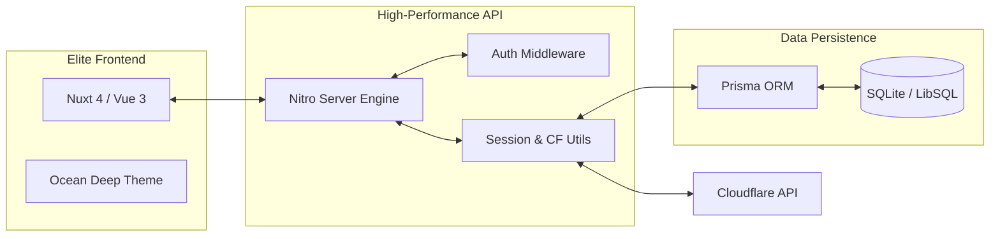

<div align="center">


# **TetherDNS**

### _Precision Cloudflare DNS & Dynamic IP Orchestrator_

<p align="center">
  <a href="https://nuxt.com/">
    
  </a>
  <a href="https://vuejs.org/">
    
  </a>
  <a href="https://tailwindcss.com/">
    
  </a>
  <a href="https://prisma.io/">
    
  </a>
  <a href="https://www.docker.com/">
    
  </a>
</p>

**TetherDNS** is a high-performance, enterprise-ready web suite designed for elite DNS management. It bridges the gap between complex network configurations and effortless control, all wrapped in a premium **Ocean Deep Tech** user experience.

[English](README.md) • [ภาษาไทย](README-TH.md)

</div>

---

## 💎 Modern DNS Management, Reimagined

More than just a utility, TetherDNS is an orchestration suite designed to respect your time and workflow.

### 🌌 The "Ocean Deep" Experience

Experience a custom-crafted UI designed for long-term management sessions:

- **Glassmorphism:** Elegant, semi-transparent layers for a focused, distraction-free workflow.
- **Deep Indigo Syntax:** Custom color theory tailored to reduce eye strain during late-night deployments.
- **Responsive Fluidity:** Flawlessly manage your entire infrastructure from a 4K desktop down to your mobile device.

---

## 🚀 Feature Galaxy

### 🔐 Core Security

- **Multi-Account Vault:** Securely organize and manage multiple Cloudflare accounts from a single dashboard.
- **TOTP 2FA Protection:** Enterprise-grade Two-Factor Authentication securing your administrative console.
- **Encrypted Sessions:** Industrial-strength, HTTP-only cookie security with strict, configurable policies.

### 🌍 Zone Mastery

- **Intelligent Explorer:** Instant search, filtering, and pagination across hundreds of managed domains.
- **Precision Record CRUD:** Add, edit, and remove `A`, `AAAA`, `CNAME`, `TXT`, `MX`, and `SRV` records with real-time validation.
- **Proxy Orchestration:** Seamlessly toggle Cloudflare's proxy (Orange Cloud) and adjust TTL settings on the fly.

### 🔄 Automation & Intelligence

- **Webhook API Generation:** Generate unique, secure URL endpoints to automate Dynamic IP (DDNS) updates from any router or script.
- **IP Analytics Engine:** Interactive visualizations tracking your IP mutations and stability over time.
- **Real-Time Audit Trail:** Immutable logging for every login, configuration change, and automated update ensuring total transparency.

---

## 🏗️ Technical Blueprint



---

## 📦 Quick Start

### 🐳 The Docker Way (Recommended)

Deploy to production in seconds with zero manual configuration:

```bash
# 1. Clone the repository
git clone https://github.com/riiixch/TetherDNS
cd TetherDNS

# 2. Configure environment variables
cp .env.example .env

# 3. Boot the engine
docker-compose up -d --build

```

### 💻 Developer Track

For developers who wish to extend, customize, or contribute:

```bash
# Install dependencies
npm install

# Initialize and push the elite database schema
npx prisma db push

# Launch the development server
npm run dev

```

---

## ⚙️ The Control Panel (.env)

Configure your instance by adjusting the parameters in your `.env` file:

| Scope           | Variable           | Significance                                                                |
| --------------- | ------------------ | --------------------------------------------------------------------------- |
| **Persistence** | `DATABASE_URL`     | Absolute path to the SQLite database (e.g., `file:/app/data/tetherdns.db`). |
| **Security**    | `SESSION_PASSWORD` | A highly secure, 32+ character encryption key for managing user sessions.   |
| **Network**     | `SESSION_SECURE`   | Set to `true` to enforce strict HTTPS transport security for cookies.       |
| **Locale**      | `TZ`               | System-wide timezone for accurate logging (e.g., `Asia/Bangkok`).           |

---

## 📜 License

Proudly distributed under the **MIT License**. We believe in open, high-quality software. See [LICENSE](https://www.google.com/search?q=LICENSE) for more details.

---

<div align="center">

### 🌊 Master Your Network. Master the Deep.

**Built with uncompromising passion by [RIIIXCH](https://github.com/riiixch)**

</div>
